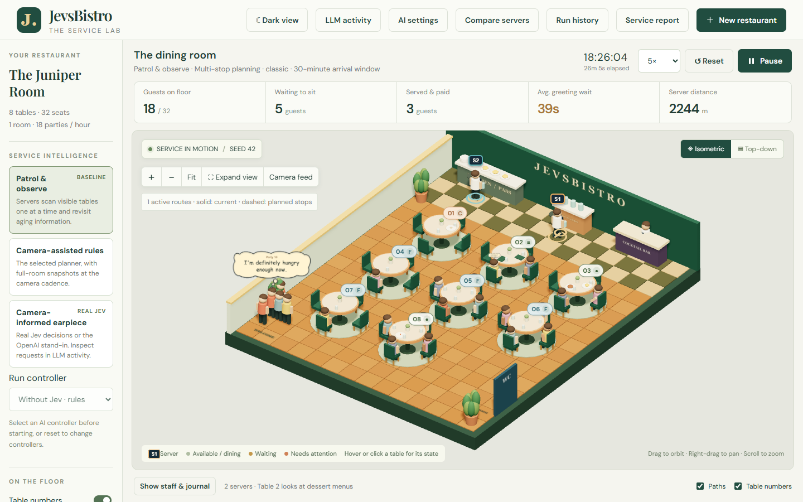
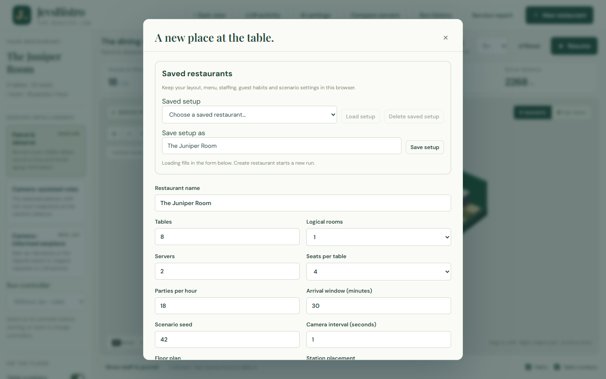
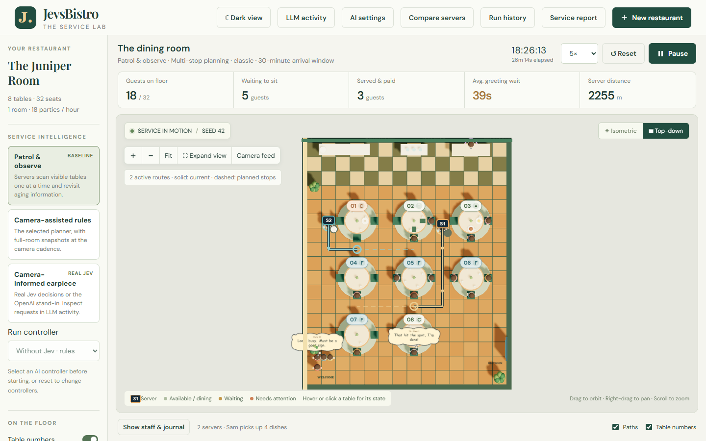
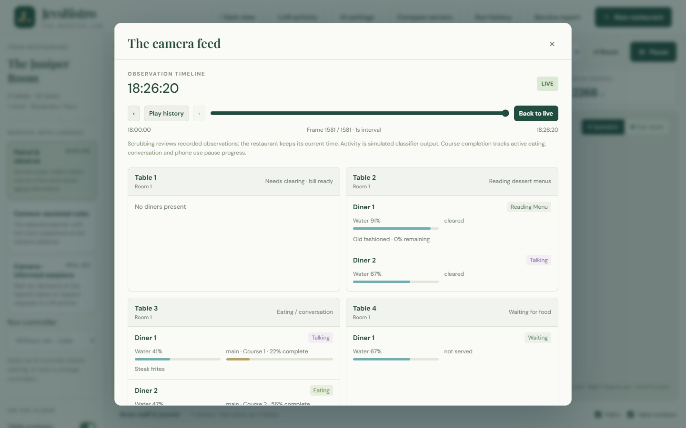
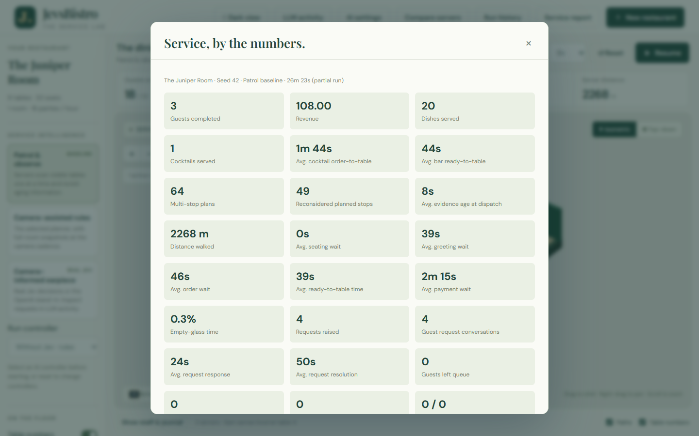
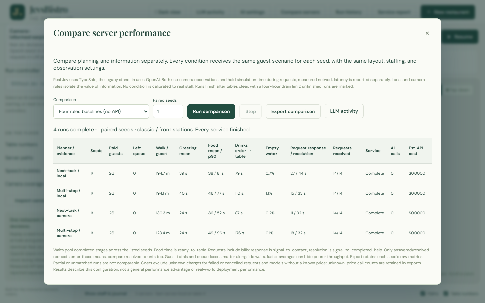
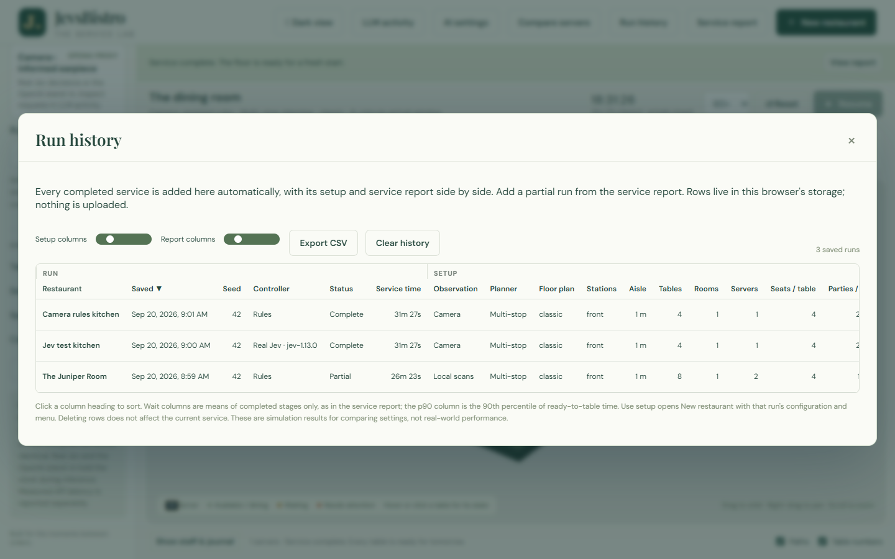
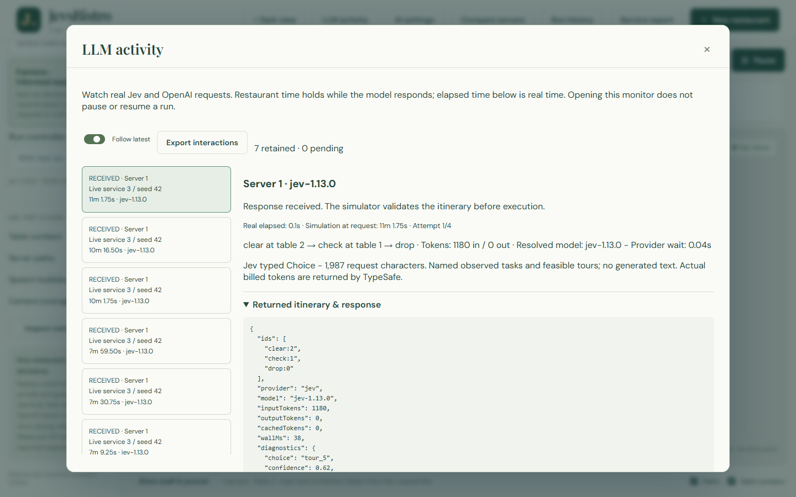
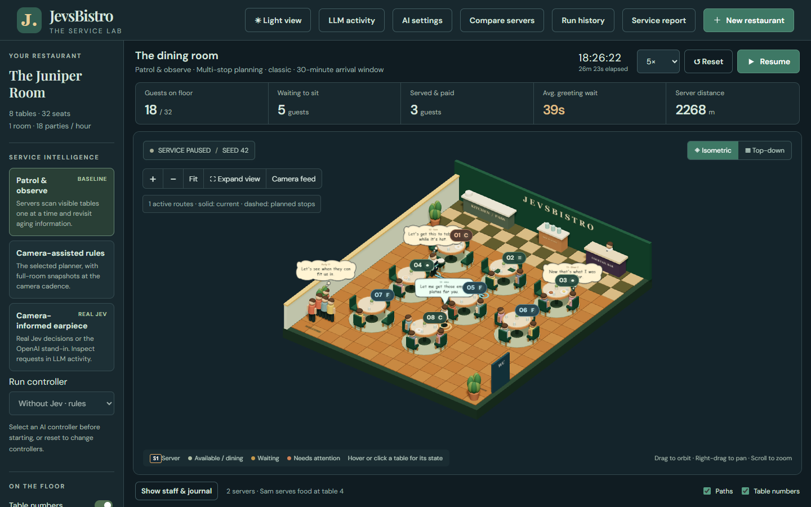

# JevsBistro

**A tiny 3D restaurant where the servers are run by rules or by an AI, so we can see who serves guests better.**



## What is this?

JevsBistro is a restaurant service simulator. Guests arrive, sit down, read the menu, order cocktails and food, eat, use their phones, ask for a fork, pay, and leave. Servers walk the floor, carry plates from the kitchen, refill water, clear tables, and answer requests.

Everything is deterministic. Pick a scenario seed and you get the exact same evening every time: the same parties at the same minute, the same dessert choices, the same dropped fork at table 3.

That is the whole trick. Because the guests never change, we can replay the same evening with a different "brain" driving the servers and compare the results fairly.

## The question we are asking

A real server deciding what to do next mostly knows what they have seen with their own eyes. JevsBistro asks what happens when we give them two upgrades, one at a time:

1. **Better information.** A camera watches the whole room, so the server knows table 6 has finished eating even though they are facing the other way.
2. **Better judgement.** A fast decision model chooses the next tour of stops, instead of a hand-written priority list.

Keeping those two separate matters. If an AI-assisted server does well, we want to know whether the credit belongs to the camera, to the model, or to both.

| Condition | Who decides | What they can see |
| --- | --- | --- |
| **Patrol and observe** | Hand-written rules | Only tables in their room, within a few metres, in front of them |
| **Camera-assisted rules** | The same rules | Full-room camera snapshots every second |
| **Camera-informed earpiece** | Jev, a low-latency decision model from TypeSafe (or an OpenAI stand-in) | The same camera snapshots |

Every condition uses the same walking speed, the same service times, and the same tray limits. The only thing that changes is how the next task gets picked.

## A fair fight

The decision maker never sees the simulation's private state. It gets observations with timestamps, what the server is carrying, and a short list of tasks that are actually possible right now. It has to pick from that list. Any answer that names a task that was not offered is rejected, and the restaurant pauses rather than quietly falling back to the rules.

When an AI is deciding, the simulated clock stops while the request is out. Network latency is measured and reported, but simulated diners are never made to wait for it. These runs compare decision quality, not deployment speed.

## What you can do

**Build a restaurant.** Choose tables, rooms, seats, staff, how busy the evening is, how often guests want appetizers, dessert, cocktails, phones, or a restroom trip. Edit the menu, prep times, and prices. Save setups you like.



**Watch service.** Orbit the room or switch to top-down. Turn on speech bubbles to see what guests and staff are thinking, and server paths to see where everyone is heading. Solid lines are the current task, dashed lines are planned stops.



**Look through the camera.** The camera feed shows exactly what a camera-assisted server would know: each diner's apparent activity, water level, plate state, and how far through their course they are. Scrub back through the evening without rewinding the restaurant.



**Read the report.** Every run produces a service report: guests served, revenue, and the average wait at each stage from seating to payment, plus walking distance, empty-glass time, and request handling.



**Compare brains side by side.** Compare servers replays the same seed under every condition in a background worker and puts the numbers in one table, so you can see what the camera bought and what the planner bought.



**Keep a history.** Every completed service lands in Run history automatically, with its full setup and its report in one wide table. Sort, export to CSV, reopen a setup, or delete rows you no longer need.



**Inspect every AI decision.** LLM activity shows the exact state sent to the model, the tours it was offered, which one it chose, how confident it was, and how long the request really took.



*The Jev responses in this screenshot were mocked locally to illustrate the panel. Real runs show the provider's actual latency and token counts.*

**Work late.** There is a dark view too.



## What this is not

It is worth being honest about the limits.

- The guests are invented. Eating speeds, phone habits, and request rates are plausible assumptions, not measurements of real diners.
- The cameras are perfect. Real computer vision makes mistakes; this simulator does not model them yet.
- The rules baseline is a reasonable heuristic, not a model of an experienced server.
- A single run proves nothing. Use several seeds and look at the cases where the camera or the model failed to help.

So JevsBistro cannot tell you how much faster a real restaurant would be. It can tell you, in a controlled setting, whether better information or better judgement changes the shape of an evening, and it lets you see exactly why.

## Try it

You need Node.js 22.12 or newer.

```sh
npm ci
npm run dev
```

Open the URL Vite prints. The rules modes work immediately with no account or API key. To try the AI conditions, open **AI settings** and paste a TypeSafe key (for real Jev) or an OpenAI key (for the stand-in). Keys are held in local server memory only and never written to disk, browser storage, or exports.

To check everything works:

```sh
npm test
npm run build
```

## Under the hood

- **TypeScript, Three.js, and Vite.** No framework.
- **The simulation is pure.** It has no browser or rendering dependency and steps in fixed quarter-second ticks. The 3D view is a projection of its state and never changes it.
- **Controllers see evidence, not the world.** They receive a copied decision context and must answer with one of the offered candidates.
- **AI calls go through a loopback-only local adapter** so API keys never reach the browser.
- **Tests cover determinism, reachability, full-service completion, evidence isolation, and invalid-action rejection.** Browser tests use Playwright.

The full description of the evidence rules, planners, metrics, AI adapters, and every deliberate abstraction lives in [docs/reference.md](docs/reference.md).

No license has been chosen yet, so the code is shared for reading and discussion; all rights reserved until one is added.
